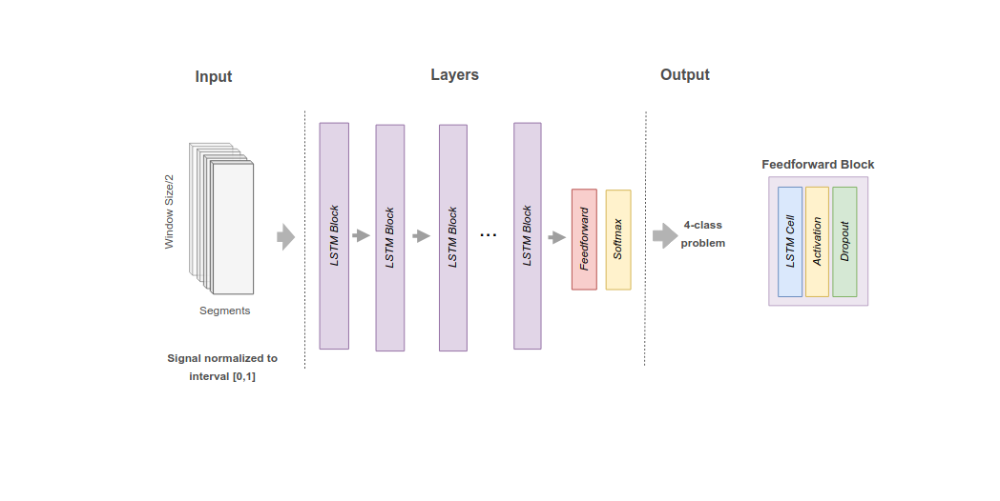
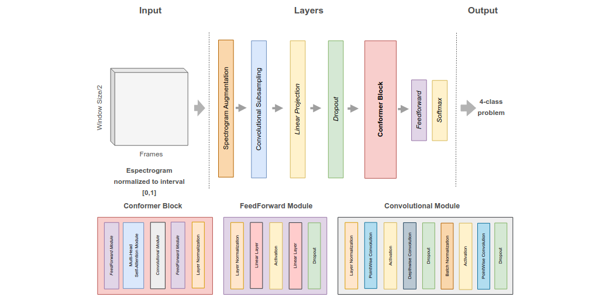
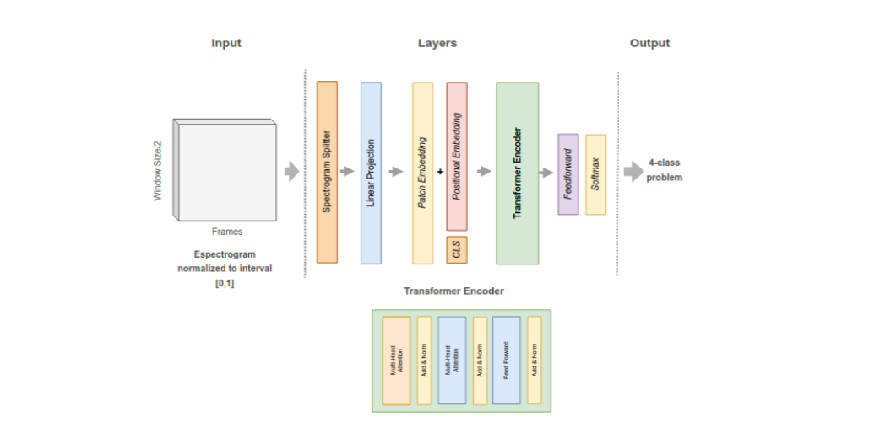

# 🚀 Neural Models
The following documentation provides a comprehensive overview of the architecture, parameters, and other relevant specifications of the neural network topologies available in this library. The selection of hyperparameters is based on an estimated performance trade-off and may not necessarily represent the optimal configuration for each topology under all conditions. The presented network architectures have been specifically adapted for audio processing and classification, ensuring their suitability for the given task. Furthermore, the versions employed in the evaluations correspond to lightweight (lite) variants, characterized by a reduced number of parameters. These models have been carefully adjusted to balance computational efficiency and task-specific performance requirements.

## General Settings
The following parameters are global and applicable to all models. These global parameters define configurations related to audio input and processing, as well as training-specific settings for the models.

### Input Samples
| Parameter      | Value  | Description |
|----------------|--------|-------------|
| Overleap       | 2      | Overlap factor for processing |
| Sample Rate    | 8000   | Audio sample rate in Hz |
| File Extension | `*.wav` | Expected file format |

### Training Configuration

| Parameter          | Value  | Description |
|--------------------|--------|-------------|
| Size Batch         | 32     | Batch size for training |
| Number Epochs      | 10     | Number of training epochs |
| Dropout Rate       | 0.1    | Dropout rate for regularization |
| Loss Function      | `crossentropy` | Loss function used |
| Optimizer Function | `adam` | Optimizer function |

## 🚩 Residual Topology
**Residual Model** has been proposed for audio classification tasks, in which input data—such as audio frames or spectrogram images—is first  segmented using a sliding time window and subsequently normalized [Paim et al. 2024].  The model begins with a two-dimensional convolutional layer that extracts local features,  Window Size/2 followed by a series of residual blocks. These residual blocks deepen the network and help  mitigate the vanishing gradient problem, thereby improving training efficiency in deeper  architectures. After feature extraction, a max pooling layer reduces the spatial dimensionality, and a dense (fully connected) layer performs the final classification, producing  a probability distribution over the target classes.
<table>
    <tbody>
        <tr>
            <th width="20%">Residual Topology</th>
        </tr>
        <tr>
            <td></td>
        </tr>
    </tbody>
</table>

## Parameters
The parameters listed below are intrinsically associated with the model or the input feature and are uniquely defined for each specific implementation. These parameters influence the behavior and performance of the model, ensuring that each implementation is tailored to its respective configuration and requirements.
### Model Architecture

| Parameter                | Value              | Description |
|--------------------------|-------------------|-------------|
| Input Dimension          | (513, 40, 1)     | Input feature dimension |
| Number Layers            | 4                | Number of layers in the model |
| Filters per Block        | [16, 32, 64, 96] | Number of filters per convolutional block |
| Size Convolutional Block | (3, 3)           | Kernel size for convolutional layers |
| Convolutional Padding    | `same`           | Padding type for convolutional layers |
| Size Polling             | (2, 2)           | Pooling size for downsampling |
| Intermediary Activation  | `relu`           | Activation function for intermediary layers |
| Last Layer Activation    | `softmax`        | Activation function for output layer |

### Spectrogram & Feature Processing

| Parameter                  | Value  | Description |
|----------------------------|--------|-------------|
| Window Size                | 1024   | Window size for STFT |
| Hop Length                 | 256    | Hop length for STFT |
| Decibel Scale Factor       | 80     | Scale factor for decibel conversion |
| Window Size Factor         | 40     | Scaling factor for window size |
| Number Filters Spectrogram | 512 | Number of spectrogram filters |

## 🚩 Multilayer Perceptron Topology
**Multilayer Perceptron (MLP)** represents a foundational architecture in machine  learning. It is composed of an input layer, one or more hidden layers, and an output layer, forming a fully connected network. Each unit, or neuron, receives input signals, applies a  weighted sum and non-linear transformation, and transmits the result forward through the  network. The hidden layers are where most of the computation takes place, enabling the  MLP to model complex, non-linear relationships in the data. The connections between  neurons are characterized by weights, which are adjusted during training through back-  propagation to minimize prediction error.

<table>
    <tbody>
        <tr>
            <th width="20%">MLP Topology</th>
        </tr>
        <tr>
            <td></td>
        </tr>
    </tbody>
</table>

## Parameters
The parameters listed below are intrinsically associated with the model or the input feature and are uniquely defined for each specific implementation. These parameters influence the behavior and performance of the model, ensuring that each implementation is tailored to its respective configuration and requirements.
### Model Architecture

| Parameter                     | Value          | Description |
|-------------------------------|---------------|-------------|
| Input Dimension               | (40, 256)     | Input feature dimension |
| List Dense Neurons            | [128, 129]    | Number of neurons in dense layers |
| Intermediary Layer Activation | `relu`        | Activation function for intermediary layers |
| Last Layer Activation         | `softmax`     | Activation function for output layer |

### Feature Processing

| Parameter                | Value  | Description |
|--------------------------|--------|------------|
| Window Size         | 1024   | Window size|
| Hop Length          | 256    | Hop length |
| Decibel Scale Factor | 80     | Scale factor for decibel conversion |
| Window Size Factor  | 40     | Scaling factor for window size |

## 🚩 Long Short-Term Memory Topology
**Long Short-Term Memory (LSTM)** is widely employed for sequential data  processing, including tasks such as language modeling and time series analysis [Hochreiter and Schmidhuber 1997]. LSTM cells are designed with internal gating mechanisms—input, forget, and output gates—that regulate information flow and allow the  network to capture long-term dependencies. As input sequences are processed, each cell  updates its internal state and transmits output to subsequent cells, maintaining a dynamic  memory across time steps. This structure enables LSTMs to retain relevant information  while filtering out noise or less significant data
<table>
    <tbody>
        <tr>
            <th width="20%">LSTM Topology</th>
        </tr>
        <tr>
            <td></td>
        </tr>
    </tbody>
</table>

## Parameters
The parameters listed below are intrinsically associated with the model or the input feature and are uniquely defined for each specific implementation. These parameters influence the behavior and performance of the model, ensuring that each implementation is tailored to its respective configuration and requirements.
### Model Architecture

| Parameter                          | Value          | Description |
|------------------------------------|---------------|-------------|
| Input Dimension                | (40, 256)     | Input feature dimension |
| List LSTM Cell               | [128, 129]    | Number of LSTM cells per layer |
| Intermediary Layer Activation  | `tanh`        | Activation function for intermediary layers |
| Recurrent Activation          | `sigmoid`     | Activation function for recurrent connections |
| Last Layer Activation         | `softmax`     | Activation function for output layer |

### Spectrogram & Feature Processing

| Parameter                | Value  | Description |
|--------------------------|--------|-------------|
| Windows Size         | 1024   | Window size for STFT |
| Hop Length        | 256    | Hop length for STFT |
| Decibel Scale Factor | 80     | Scale factor for decibel conversion |
| Window Size Factor  | 40     | Scaling factor for window size |

## 🚩Conformer Topology
**Conformer** model, whose reference implementation considered in this  research  is specifically designed for audio signal processing tasks,  such as automatic speech recognition [Gulati et al. 2020]. It begins with a data augmentation step using SpecAugment, followed by convolutional subsampling to reduce the temporal resolution while preserving salient features. The subsampled input is transformed  via a linear layer and passed through a dropout layer to reduce the risk of overfitting. The  core of the model consists of a series of Conformer blocks, which integrate convolutional  modules with transformer-based self-attention. This hybrid design enables the model to  effectively capture both local patterns and global dependencies, making it well-suited for  complex audio modeling tasks.

<table>
    <tbody>
        <tr>
            <th width="20%">Conformer Topology</th>
        </tr>
        <tr>
            <td></td>
        </tr>
    </tbody>
</table>

## Parameters
The parameters listed below are intrinsically associated with the model or the input feature and are uniquely defined for each specific implementation. These parameters influence the behavior and performance of the model, ensuring that each implementation is tailored to its respective configuration and requirements.
### Model Architecture

| Parameter                       | Value  | Description |
|---------------------------------|--------|-------------|
| Number Heads              | 4      | Number of attention heads |
| Number Conformer Blocks    | 4      | Number of Conformer blocks |
| Last Layer Activation      | `softmax` | Activation function for output layer |
| Input Dimension            | (80, 40) | Input feature dimension |

### Spectrogram & Feature Processing

| Parameter                      | Value  | Description |
|--------------------------------|--------|-------------|
| Window Size             | 1024   | Window size for STFT |
| Hop Length                | 256    | Hop length for STFT |
| Number Filters Spectrogram | 80     | Number of filters in spectrogram processing |
| Decibel Scale Factor       | 80     | Scale factor for decibel conversion |
| Window Size Factor       | 40     | Scaling factor for window size |

### Additional Parameters

| Parameter                  | Value  | Description |
|----------------------------|--------|-------------|
| Number Splits        | 5      | Number of data splits |
| Kernel Size            | 3      | Size of the convolutional kernel |
| Embedding Dimension    | 64     | Embedding vector dimensionality |

### 🚩 Audio Spectrogram Transformer (AST) Topology

<table>
    <tbody>
        <tr>
            <th width="20%">Audio Spectrogram Transformer Topology</th>
        </tr>
        <tr>
            <td></td>
        </tr>
    </tbody>
</table>

## Parameters
The parameters listed below are intrinsically associated with the model or the input feature and are uniquely defined for each specific implementation. These parameters influence the behavior and performance of the model, ensuring that each implementation is tailored to its respective configuration and requirements.
### General Settings

**Audio Spectrogram Transformer (AST)**, introduced by [Gong et al. 2021],  adapts the transformer architecture for audio classification tasks. It operates by segmenting the input spectrogram into overlapping patches, which are linearly projected and enriched with positional and class embeddings. These patches are then fed into a Transformer encoder, which models the sequence through self-attention mechanisms. The encoder output is finally passed through a linear layer to produce class predictions. By  leveraging the global attention capabilities of transformers, AST can capture both local  and contextual features within audio data. Figure 3b shows a view of the basic architectural model, as we implemented in our evaluation.

## Model Architecture

| Parameter                  | Value  | Description |
|----------------------------|--------|-------------|
| Number Blocks          | 2      | Number of transformer blocks |
| Number Head           | 2      | Number of attention heads |
| Head Size              | 64     | Size of each attention head |
| Intermediary Activation | `relu` | Activation function for intermediate layers |
| Last Layer Activation   | `softmax` | Activation function for output layer |

## Spectrogram & Patch Processing

| Parameter                  | Value  | Description |
|----------------------------|--------|-------------|
| Size FFT               | 1024   | FFT window size |
| Hop Length             | 512    | Hop length for STFT |
| Number Filters Spectrogram | 512 | Number of filters in spectrogram processing |
| Decibel Scale Factor   | 80     | Scale factor for decibel conversion |
| Size Patch             | (16,16) | Patch size for spectrogram processing |
| Window Size Factor     | 40     | Scaling factor for window size |

## Additional Parameters

| Parameter                  | Value  | Description |
|----------------------------|--------|-------------|
| Number Splits          | 5      | Number of data splits |
| Audio Duration         | 10     | Audio clip duration in seconds |
| Number Filters         | 64     | Number of convolutional filters |
| Projection Dimension   | 16     | Dimensionality of projection layer |
