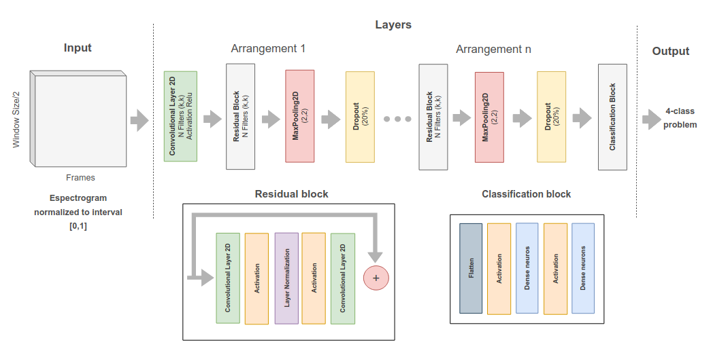
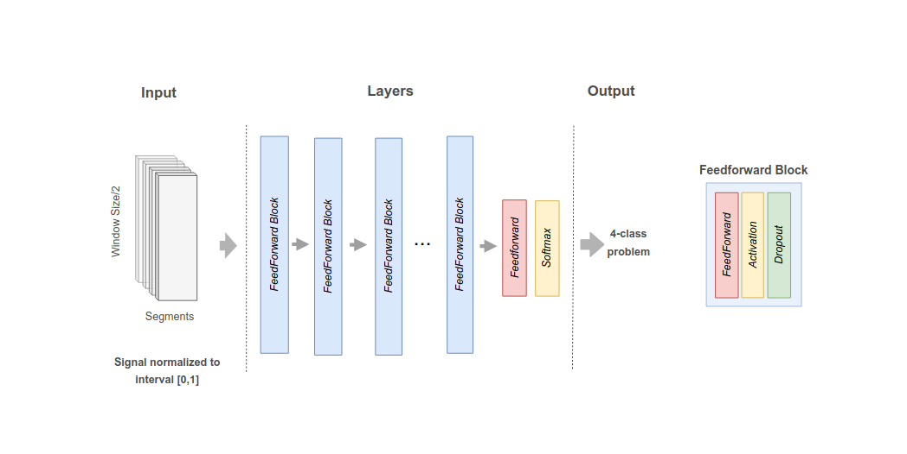

## Residual Topology
The Residual Model, shown in Figure 1, has been proposed for audio classification tasks, in which input data—such as audio frames or spectrogram images—is first  segmented using a sliding time window and subsequently normalized [Paim et al. 2024].  The model begins with a two-dimensional convolutional layer that extracts local features,  Window Size/2 followed by a series of residual blocks. These residual blocks deepen the network and help  mitigate the vanishing gradient problem, thereby improving training efficiency in deeper  architectures. After feature extraction, a max pooling layer reduces the spatial dimensionality, and a dense (fully connected) layer performs the final classification, producing  a probability distribution over the target classes.
<table>
    <tbody>
        <tr>
            <th width="20%">Residual Topology</th>
        </tr>
        <tr>
            <td></td>
        </tr>
    </tbody>
</table>

## Parameters
### General Settings

| Parameter              | Value  | Description |
|------------------------|--------|-------------|
| **OVERLAP**           | 2      | Overlap factor for processing |
| **SAMPLE_RATE**       | 8000   | Audio sample rate in Hz |
| **FILE_EXTENSION**    | `*.wav` | Expected file format |

### Model Architecture

| Parameter                          | Value              | Description |
|------------------------------------|-------------------|-------------|
| **INPUT_DIMENSION**                | (513, 40, 1)     | Input feature dimension |
| **NUMBER_LAYERS**                  | 4                | Number of layers in the model |
| **FILTERS_PER_BLOCK**              | [16, 32, 64, 96] | Number of filters per convolutional block |
| **SIZE_CONVOLUTIONAL_FILTERS**     | (3, 3)           | Kernel size for convolutional layers |
| **CONVOLUTIONAL_PADDING**          | `same`           | Padding type for convolutional layers |
| **SIZE_POOLING**                   | (2, 2)           | Pooling size for downsampling |
| **INTERMEDIARY_ACTIVATION**        | `relu`           | Activation function for intermediary layers |
| **LAST_LAYER_ACTIVATION**          | `softmax`        | Activation function for output layer |

### Spectrogram & Feature Processing

| Parameter                | Value  | Description |
|--------------------------|--------|-------------|
| **WINDOW_SIZE**         | 1024   | Window size for STFT |
| **HOP_LENGTH**          | 256    | Hop length for STFT |
| **DECIBEL_SCALE_FACTOR** | 80     | Scale factor for decibel conversion |
| **WINDOW_SIZE_FACTOR**  | 40     | Scaling factor for window size |
| **NUMBER_FILTERS_SPECTROGRAM** | 512 | Number of spectrogram filters |

### Training Configuration

| Parameter                  | Value  | Description |
|----------------------------|--------|-------------|
| **SIZE_BATCH**             | 32     | Batch size for training |
| **NUMBER_EPOCHS**          | 10     | Number of training epochs |
| **DROPOUT_RATE**           | 0.1    | Dropout rate for regularization |
| **LOSS_FUNCTION**          | `crossentropy` | Loss function used |
| **OPTIMIZER_FUNCTION**     | `adam` | Optimizer function |

### Classification Parameters

| Parameter            | Value  | Description |
|----------------------|--------|-------------|
| **NUMBER_CLASSES**  | 4      | Number of output classes |

### Additional Parameters

| Parameter          | Value  | Description |
|--------------------|--------|-------------|
| **NUMBER_SPLITS** | 5      | Number of data splits |

## Multilayer Perceptron Topology
Multilayer Perceptron (MLP) represents a foundational architecture in machine
learning. It is composed of an input layer, one or more hidden layers, and an output layer,
forming a fully connected network. Each unit, or neuron, receives input signals, applies a
weighted sum and non-linear transformation, and transmits the result forward through the
network. The hidden layers are where most of the computation takes place, enabling the
MLP to model complex, non-linear relationships in the data. The connections between
neurons are characterized by weights, which are adjusted during training through back-
propagation to minimize prediction error.
<table>
    <tbody>
        <tr>
            <th width="20%">MLP Topology</th>
        </tr>
        <tr>
            <td></td>
        </tr>
    </tbody>
</table>

## Parameters
### General Settings

| Parameter              | Value  | Description |
|------------------------|--------|-------------|
| **OVERLAP**           | 2      | Overlap factor for processing |
| **SAMPLE_RATE**       | 8000   | Audio sample rate in Hz |
| **FILE_EXTENSION**    | `*.wav` | Expected file format |

### Model Architecture

| Parameter                          | Value          | Description |
|------------------------------------|---------------|-------------|
| **INPUT_DIMENSION**                | (40, 256)     | Input feature dimension |
| **LIST_DENSE_NEURONS**             | [128, 129]    | Number of neurons in dense layers |
| **INTERMEDIARY_LAYER_ACTIVATION**  | `relu`        | Activation function for intermediary layers |
| **LAST_LAYER_ACTIVATION**          | `softmax`     | Activation function for output layer |

### Feature Processing

| Parameter                | Value  | Description |
|--------------------------|--------|------------|
| **WINDOW_SIZE**         | 1024   | Window size|
| **HOP_LENGTH**          | 256    | Hop length |
| **DECIBEL_SCALE_FACTOR** | 80     | Scale factor for decibel conversion |
| **WINDOW_SIZE_FACTOR**  | 40     | Scaling factor for window size |

### Training Configuration

| Parameter                  | Value  | Description |
|----------------------------|--------|-------------|
| **SIZE_BATCH**             | 32     | Batch size for training |
| **NUMBER_EPOCHS**          | 10     | Number of training epochs |
| **DROPOUT_RATE**           | 0.1    | Dropout rate for regularization |
| **LOSS_FUNCTION**          | `crossentropy` | Loss function used |
| **OPTIMIZER_FUNCTION**     | `adam` | Optimizer function |

### Classification Parameters

| Parameter            | Value  | Description |
|----------------------|--------|-------------|
| **NUMBER_CLASSES**  | 4      | Number of output classes |

### Additional Parameters

| Parameter          | Value  | Description |
|--------------------|--------|-------------|
| **NUMBER_SPLITS** | 5      | Number of data splits |

---
