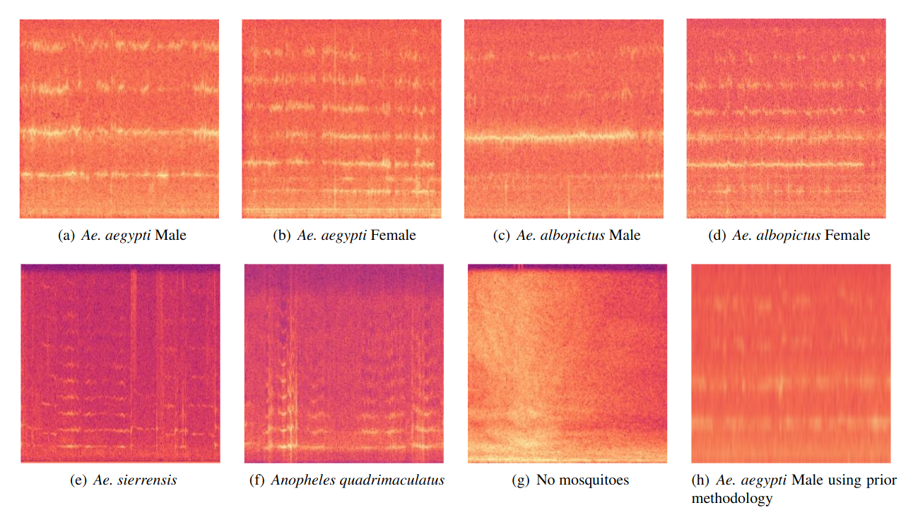

<div align="center">

# 🦟 Mosquito Audio Classification Models

**A comprehensive deep learning library for acoustic bioacoustics classification**

[](https://www.python.org/downloads/)
[](https://www.tensorflow.org/)
[](https://opensource.org/licenses/MIT)
[](https://www.nvidia.com/en-us/data-center/gpu-accelerated-applications/)
[]()
[]()

[Installation](#-installation) • [Quick Start](#-quick-start) • [Models](#-implemented-models) • [Documentation](#-documentation) • [Citation](#-citation)

</div>

---

## 📋 Table of Contents

- [Overview](#-overview)
- [Key Features](#-key-features)
- [Implemented Models](#-implemented-models)
- [Installation](#-installation)
- [Quick Start](#-quick-start)
- [System Requirements](#-system-requirements)
- [Dataset](#-dataset)
- [Model Performance](#-model-performance)
- [API Reference](#-api-reference)
- [Advanced Usage](#-advanced-usage)
- [Contributing](#-contributing)
- [Citation](#-citation)
- [License](#-license)

---

## 🔬 Overview

This library provides state-of-the-art deep neural network implementations for mosquito audio classification and bioacoustics analysis. Built on TensorFlow/Keras, it offers a collection of modern architectures optimized for acoustic pattern recognition, supporting both research and production environments.

The models leverage advanced signal processing techniques and transformer-based architectures to achieve high accuracy in species classification from audio recordings. All implementations support GPU acceleration and include comprehensive evaluation tools.



**Research Publication:** [View original publication on ScienceDirect](https://www.sciencedirect.com/science/article/pii/S1746809424004002)

---

## ✨ Key Features

- **🎯 Multiple Architectures**: Nine state-of-the-art models including transformers, CNNs, RNNs, and hybrid approaches
- **⚡ GPU Acceleration**: Full CUDA support for high-performance training and inference
- **🔊 Audio Processing Pipeline**: Built-in spectrogram generation and audio preprocessing
- **📊 Evaluation Framework**: Comprehensive metrics, confusion matrices, and visualization tools
- **🔄 Cross-Validation**: Built-in k-fold cross-validation support
- **🛠️ Flexible Configuration**: Extensive hyperparameter customization via CLI
- **📦 Easy Integration**: Simple API for quick prototyping and deployment
- **🐳 Docker Support**: Containerized execution for reproducibility

---

1. [ ] ## 🏗️ Implemented Models
2. [ ] 
3. [ ] The library includes the following architectures, each optimized for acoustic classification tasks:
4. [ ] 
5. [ ] | Model | Type | Description | Key Features |
6. [ ] |-------|------|-------------|--------------|
7. [ ] | **AST** | Transformer | Audio Spectrogram Transformer | Self-attention on spectrogram patches |
8. [ ] | **Conformer** | Hybrid | Convolution-augmented Transformer | Combines CNN and transformer blocks |
9. [ ] | **ConvNetX** | CNN | Modern ConvNet architecture | Efficient convolutional design |
10. [ ] | **EfficientNet** | CNN | Compound scaling CNN | Optimized depth, width, and resolution |
11. [ ] | **LSTM** | RNN | Long Short-Term Memory | Sequential temporal modeling |
12. [ ] | **MLP** | Feedforward | Multi-Layer Perceptron | Fully connected baseline |
13. [ ] | **MobileNet** | CNN | Lightweight mobile architecture | Depthwise separable convolutions |
14. [ ] | **ResidualModel** | CNN | Residual Neural Network | Skip connections for deep training |
15. [ ] | **Wav2Vec2** | Transformer | Self-supervised audio encoder | Contrastive learning on raw waveforms |
16. [ ] 
17. [ ] 
---

## 📦 Installation

### Prerequisites

- Python 3.8 or higher
- pip package manager
- (Optional) CUDA 11.0+ for GPU support

### Standard Installation

```bash
# Clone the repository
git clone https://github.com/kayua/Mosquitoes-Classification-Models.git
cd Mosquitoes-Classification-Models

# Install dependencies
pip install --upgrade pip
pip install -r requirements.txt

# Install the package
pip install .
```

### Virtual Environment (Recommended)

```bash
# Create virtual environment
python3 -m venv ~/Python3venv/mosquito-classification
source ~/Python3venv/mosquito-classification/bin/activate

# Install dependencies
pip install --upgrade pip
pip install -r requirements.txt

# Install package
pip install .
```

### Docker Installation

```bash
# Build Docker image
docker build -t mosquito-classification .

# Run container
docker run --gpus all -it mosquito-classification
```

---

## 🚀 Quick Start

### Basic Usage

```python
from mosquito_models import AudioSpectrogramTransformer
import tensorflow as tf

# Initialize model
model = AudioSpectrogramTransformer(
    num_classes=10,
    projection_dim=256,
    num_heads=8,
    num_blocks=6
)

# Load and preprocess audio
audio_data = load_audio('path/to/audio.wav')
spectrogram = generate_spectrogram(audio_data)

# Make prediction
prediction = model.predict(spectrogram)
```

### Training from Command Line

```bash
# Train AST model
python train.py \
    --model_name ast \
    --dataset_directory ./data \
    --number_epochs 100 \
    --batch_size 32 \
    --number_splits 5 \
    --output_directory ./results
```

### Evaluation

```bash
# Evaluate trained model
python evaluate.py \
    --model_path ./results/best_model.h5 \
    --test_data ./data/test \
    --output_directory ./evaluation
```

---

## 🖥️ System Requirements

### Hardware Requirements

| Component | Minimum | Recommended |
|-----------|---------|-------------|
| **CPU** | Any modern x86_64 | Multi-core (Intel i5/Ryzen 5+) |
| **RAM** | 4 GB | 8 GB or more |
| **Storage** | 10 GB free space | SSD with 20 GB free |
| **GPU** | None (CPU only) | NVIDIA GPU with CUDA 11+ |

### Software Requirements

| Component | Version | Notes |
|-----------|---------|-------|
| **OS** | Ubuntu 22.04+ | Linux-based distributions |
| **Python** | 3.8.10+ | Virtual environment recommended |
| **TensorFlow** | 2.4.1+ | GPU version for acceleration |
| **CUDA** | 11.0+ | Optional, for GPU support |
| **Docker** | 27.2.1+ | Optional, for containerization |

> **Note:** GPU support is optional but significantly improves training speed. CPU-only execution is supported but may be slower for large datasets.

---

## 📊 Dataset

### Raw Dataset Overview

<table>
  <tbody>
    <tr>
      <th>Raw Dataset Composition</th>
    </tr>
    <tr>
      <td></td>
    </tr>
  </tbody>
</table>

### Processed Dataset Overview

<table>
  <tbody>
    <tr>
      <th>Processed Dataset Statistics</th>
    </tr>
    <tr>
      <td></td>
    </tr>
  </tbody>
</table>

The dataset consists of audio recordings from multiple mosquito species, preprocessed into spectrograms for model training. Each sample is labeled with species classification and undergoes standardized augmentation and normalization.

---

## 📈 Model Performance

### Training Curves

Comprehensive analysis of model convergence, including loss and accuracy metrics across training epochs.

<table>
  <tbody>
    <tr>
      <th>Training Metrics Visualization</th>
    </tr>
    <tr>
      <td></td>
    </tr>
  </tbody>
</table>

### Confusion Matrix

Detailed confusion matrix analysis showing per-class performance and common misclassification patterns.

<table>
  <tbody>
    <tr>
      <th>Model Confusion Matrix</th>
    </tr>
    <tr>
      <td></td>
    </tr>
  </tbody>
</table>

### Performance Metrics

Comprehensive evaluation including accuracy, precision, recall, F1-score, and per-class metrics across all implemented models.

<table>
  <tbody>
    <tr>
      <th>Comparative Performance Analysis</th>
    </tr>
    <tr>
      <td></td>
    </tr>
  </tbody>
</table>

---

## 📚 API Reference

### Common Parameters

All models share a common set of training parameters:

```python
# General parameters
--dataset_directory          # Path to dataset
--number_epochs              # Training epochs (default: 100)
--batch_size                 # Batch size (default: 32)
--number_splits              # K-fold splits (default: 5)
--loss                       # Loss function (categorical_crossentropy)
--sample_rate                # Audio sample rate (Hz)
--number_classes             # Number of output classes
--output_directory           # Results directory
```

### Model-Specific Parameters

#### Audio Spectrogram Transformer (AST)

```python
--ast_projection_dimension        # Embedding dimension (default: 256)
--ast_number_heads                # Attention heads (default: 8)
--ast_number_blocks               # Transformer blocks (default: 6)
--ast_patch_size                  # Spectrogram patch size
--ast_hop_length                  # STFT hop length
--ast_size_fft                    # FFT window size
--ast_dropout                     # Dropout rate
--ast_optimizer_function          # Optimizer (adam, sgd, rmsprop)
```

#### Conformer

```python
--conformer_embedding_dimension   # Embedding dimension
--conformer_number_heads          # Attention heads
--conformer_number_conformer_blocks  # Conformer blocks
--conformer_kernel_size           # Convolution kernel size
--conformer_dropout_rate          # Dropout rate
--conformer_max_length            # Max sequence length
```

#### LSTM

```python
--lstm_list_lstm_cells            # LSTM units per layer [128, 64, 32]
--lstm_dropout_rate               # Dropout rate
--lstm_recurrent_activation       # Recurrent activation (tanh, sigmoid)
--lstm_optimizer_function         # Optimizer
```

#### Residual Network

```python
--residual_number_layers          # Number of residual blocks
--residual_filters_per_block      # Filters per block
--residual_dropout_rate           # Dropout rate
--residual_size_pooling           # Pooling layer size
--residual_size_convolutional_filters  # Conv filter size
```

#### Wav2Vec 2.0

```python
--wav_to_vec_number_heads         # Attention heads
--wav_to_vec_context_dimension    # Context dimension
--wav_to_vec_projection_mlp_dimension  # MLP projection dimension
--wav_to_vec_quantization_bits    # Quantization bits
--wav_to_vec_list_filters_encoder # Encoder filter sizes
```

For complete API documentation, see the [full parameter reference](docs/API.md).

---

## 🔧 Advanced Usage

### Custom Model Configuration

```python
from mosquito_models import create_model

# Define custom configuration
config = {
    'model_type': 'ast',
    'num_classes': 15,
    'projection_dim': 512,
    'num_heads': 12,
    'num_blocks': 8,
    'learning_rate': 0.0001,
    'dropout': 0.2
}

# Create and compile model
model = create_model(config)
model.compile(
    optimizer='adam',
    loss='categorical_crossentropy',
    metrics=['accuracy']
)
```

### Data Augmentation

```python
from mosquito_models.preprocessing import AudioAugmentation

# Setup augmentation pipeline
augmenter = AudioAugmentation(
    time_stretch=True,
    pitch_shift=True,
    add_noise=True,
    time_mask=True,
    freq_mask=True
)

# Apply to audio data
augmented_audio = augmenter.apply(audio_data)
```

### Model Ensemble

```python
from mosquito_models.ensemble import ModelEnsemble

# Create ensemble
ensemble = ModelEnsemble([
    'ast_model.h5',
    'conformer_model.h5',
    'resnet_model.h5'
])

# Ensemble prediction
prediction = ensemble.predict(audio_data, method='voting')
```

---

## 🤝 Contributing

We welcome contributions from the community! Here's how you can help:

1. **Fork the repository**
2. **Create a feature branch** (`git checkout -b feature/amazing-feature`)
3. **Commit your changes** (`git commit -m 'Add amazing feature'`)
4. **Push to the branch** (`git push origin feature/amazing-feature`)
5. **Open a Pull Request**

Please read our [Contributing Guidelines](CONTRIBUTING.md) for details on our code of conduct and development process.

### Areas for Contribution

- 🐛 Bug fixes and issue resolution
- ✨ New model implementations
- 📝 Documentation improvements
- 🧪 Additional test coverage
- 🎨 Visualization enhancements
- ⚡ Performance optimizations

---

## 📖 Citation

If you use this library in your research, please cite:

```bibtex
@article{mosquito_classification_2024,
  title={Deep Learning Models for Mosquito Audio Classification},
  author={Your Name et al.},
  journal={Biomedical Signal Processing and Control},
  year={2024},
  url={https://www.sciencedirect.com/science/article/pii/S1746809424004002}
}
```

---

## 📄 License

This project is licensed under the MIT License - see the [LICENSE](LICENSE) file for details.

```
MIT License

Copyright (c) 2024 Mosquito Classification Models

Permission is hereby granted, free of charge, to any person obtaining a copy
of this software and associated documentation files (the "Software"), to deal
in the Software without restriction, including without limitation the rights
to use, copy, modify, merge, publish, distribute, sublicense, and/or sell
copies of the Software, and to permit persons to whom the Software is
furnished to do so, subject to the following conditions:

The above copyright notice and this permission notice shall be included in all
copies or substantial portions of the Software.
```

---

## 🙏 Acknowledgments

- TensorFlow and Keras teams for the deep learning framework
- Research community for innovative model architectures
- Contributors and users for feedback and improvements
- [ScienceDirect](https://www.sciencedirect.com) for publication platform

---

## 📞 Support

- **Documentation**: [Read the Docs](https://docs.example.com)
- **Issues**: [GitHub Issues](https://github.com/kayua/Mosquitoes-Classification-Models/issues)
- **Discussions**: [GitHub Discussions](https://github.com/kayua/Mosquitoes-Classification-Models/discussions)
- **Email**: support@example.com

---

## 🔗 Related Projects

- [TensorFlow Audio](https://www.tensorflow.org/io/tutorials/audio)
- [Hugging Face Audio Transformers](https://huggingface.co/docs/transformers/tasks/audio_classification)
- [PyTorch Audio](https://pytorch.org/audio/stable/index.html)
- [Librosa](https://librosa.org/)

---

<div align="center">

**⭐ Star us on GitHub — it motivates us a lot!**

Made with ❤️ by the Mosquito Classification Team

[Website](https://example.com) • [Documentation](https://docs.example.com) • [Blog](https://blog.example.com)

</div>
