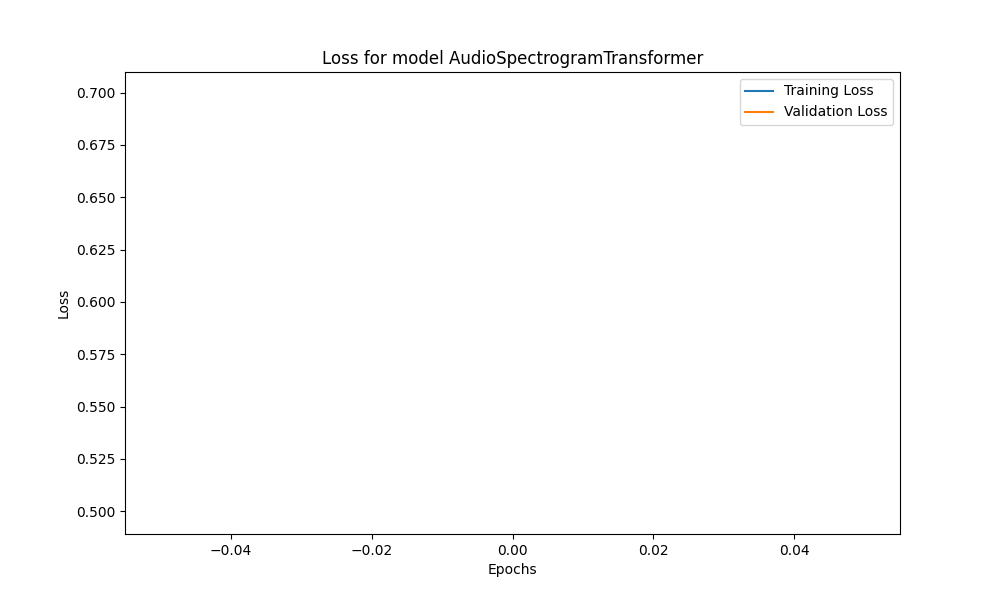
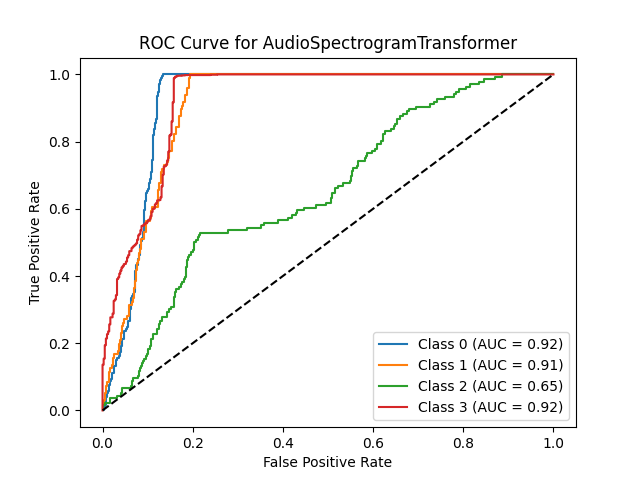

# Sound classification - Neural Network Models
---------------------
This repository contains the implemented code for the classification of mosquito audios using deep neural networks. It includes state-of-the-art algorithms and advanced techniques employed in the study, providing a robust basis for the analysis and categorization of complex acoustic patterns. 

[View original publication](https://www.sciencedirect.com/science/article/pii/S1746809424004002)

The code made available aims to facilitate the replication of the experiments and the application of state-of-the-art methodologies in audio processing and bioacoustics. The implementation contains the definitions of the models, layers, blocks and loss functions necessary for the correct functioning of the models, as well as an evaluation framework that allows the analysis of the models' performance.

---------------------
## Neural Network Topologies

This repository contains the implementation and evaluation of six distinct deep neural network topologies for audio recognition. Each topology was developed for the analysis and identification of specific acoustic patterns in the audio emitted by mosquito wings, providing a robust technical basis for the comparative evaluation of the proposed solutions. Below are listed each of the topologies present in this repository, as well as their structure and original work.

### Original Papers:

1. Audio Spectrogram Transformer [https://arxiv.org/abs/2104.01778]
2. Long Short Term Memory [https://www.bioinf.jku.at/publications/older/2604.pdf]
3. Conformer [https://arxiv.org/abs/2005.08100]
4. Wav2Vec2 [https://arxiv.org/abs/2006.11477]
5. Residual [https://doi.org/10.1016/j.bspc.2024.106342]
6. MLP [https://ieeexplore.ieee.org/document/8942209]

---------------------
## Models:

---------------------
<table>
    <tbody>
        <tr>
            <th width="20%">AST Topology</th>
            <th width="20%">LSTM Topology</th>
            <th width="20%">Conformer Topology</th>
        </tr>
        <tr>
            <td></td>
            <td></td>
            <td></td>
        </tr>
    </tbody>
    <tbody>
        <tr>
            <th width="20%">Wav2Vec2 Topology</th>
            <th width="20%">Residual Topology</th>
            <th width="20%">MLP Topology</th>
        </tr>
        <tr>
            <td></td>
            <td></td>
            <td></td>
        </tr>
    </tbody>
</table>

## Experimental Evaluation
---------------------
### Dataset for Experiments RAW

Description of the datasets used to train and validate the models, as well as the link to obtain them. The table below details the raw dataset obtained.
<table>
    <tbody> 
        <tr>
            <th width="10%">Dataset RAW</th>
        </tr>
        <tr>
            <td></td>
        </tr>

</table>

### Dataset for Experiments Processed

Description of the datasets used to train and validate the models, as well as the link to obtain them. The table below details the processed dataset obtained.

<table>
    <tbody> 
        <tr>
            <th width="10%">Dataset Processed</th>
        </tr>
        <tr>
            <td></td>
        </tr>

</table>

## Training Parameters
---------------------

Definition of general parameters used for the evaluation. The parameters were chosen to obtain the fairest possible configuration with all models. The selection process considered various factors to ensure that the evaluation metrics are unbiased and provide an accurate representation of each model's performance under similar conditions. This approach ensures that comparisons between models are valid and meaningful.

### Parameters evaluated
| Parameter                  | Description                          | Evaluated Value           |
|----------------------------|--------------------------------------|---------------------------|
| **Epochs**                 | Total number of training epochs      | [10, 20, 30]              |
| **Learning Rate**          | Learning rate used                   | [0.1, 0.01, 0.001]        |
| **Loss Function**          | Loss function employed               | [Categorical Cross-Entropy] |
| **Optimization Algorithm** | Optimization algorithm used          | [Adam]                    |
| **Number of Folds**        | Number of folds for cross-validation | [10]                      |
| **Batch Size**             | Batch size for training              | [32]                      |
| **Sample Rate**            | Sample rate of sounds                | [8000]                    |
| **Segment Length**         | Length of sound segment              | [40, 60]                  |

## Fitting Analysis

This section is dedicated to the evaluation of models, providing a comprehensive analysis of training curves, confusion matrices, and performance metrics. Through this approach, we ensure a deep understanding of each model's strengths and weaknesses, allowing for continuous adjustments and improvements.

---------------------
### Training Curve
Visualization of the training curves for each of the six model topologies, showing both the training curve and the validation curve. Using cross entropy as a metric, these curves allow a detailed evaluation of the performance of two models and are used to identify possible problems during training, such as overfitting.

<table>
    <tbody> 
        <tr>
            <th width="10%">AST Topology</th>
            <th width="10%">LSTM Topology</th>
            <th width="10%">Conformer Topology</th>
        </tr>
        <tr>
            <td></td>
            <td></td>
            <td></td>
        </tr>
   <tbody> 
        <tr>
            <th width="10%">Wav2Vec2</th>
            <th width="10%">Residual</th>
            <th width="10%">MLP</th>
        </tr>
        <tr>
            <td></td>
            <td></td>
            <td></td>
        </tr>

</table>

## Evaluation Analysis

---------------------
### Confusion Matrices
Multiclass confusion matrices for each of the evaluated models. The configurations were defined based on the best configuration found among those evaluated.
<table>
    <tbody> 
        <tr>
            <th width="10%">AST Topology</th>
            <th width="10%">LSTM Topology</th>
            <th width="10%">Conformer Topology</th>
        </tr>
        <tr>
            <td></td>
            <td></td>
            <td></td>
        </tr>
   <tbody> 
        <tr>
            <th width="10%">Wav2Vec2</th>
            <th width="10%">Residual</th>
            <th width="10%">MLP</th>
        </tr>
        <tr>
            <td></td>
            <td></td>
            <td></td>
        </tr>

</table>

### ROC Curve
Visualization of the ROC curves for each of the six model topologies, showing both the training and validation ROC curves. Using the area under the curve (AUC) metric, these curves provide a detailed evaluation of model performance and help identify potential issues during training, such as model generalization capacity.

<table>
    <tbody> 
        <tr>
            <th width="10%">AST Topology</th>
            <th width="10%">LSTM Topology</th>
            <th width="10%">Conformer Topology</th>
        </tr>
        <tr>
            <td></td>
            <td></td>
            <td></td>
        </tr>
   <tbody> 
        <tr>
            <th width="10%">Wav2Vec2</th>
            <th width="10%">Residual</th>
            <th width="10%">MLP</th>
        </tr>
        <tr>
            <td></td>
            <td></td>
            <td></td>
        </tr>

</table>

### Comparing our Neural Networks
This comprehensive analysis evaluates the performance of several models by comparing key metrics, including accuracy, precision, recall, and F1-score. These metrics provide insights into each model's ability to correctly classify data, balance false positives and false negatives, and overall performance. The comparison aims to identify the most effective model for the given task.
<table>
    <tbody> 
        <tr>
            <th width="10%">Comparison Between Models.</th>
        </tr>
        <tr>
            <td></td>
        </tr>
        
</table>

## Steps to Install:
---------------------

1. Upgrade and update
    - sudo apt-get update
    - sudo apt-get upgrade 
    
2. Installation of application and internal dependencies
    - git clone [https://github.com/kayua/ModelsAudioClassification]
    - pip install -r requirements.txt

   
## Run experiments:
---------------------

###  Run (EvaluationModels.py)
`python3 EvaluationModels.py`

### Input parameters:

    Arguments:
      --dataset_directory", Directory containing the dataset.
      --number_epochs", Number of training epochs.
      --batch_size", Size of the batches for training.
      --number_splits", Number of splits for cross-validation.
      --loss", Loss function to use during training.
      --sample_rate", Sample rate of the audio files.
      --overlap", Overlap for the audio segments.
      --number_classes", Number of classes in the dataset.
      --output_directory", Directory to save output files.
      --plot_width", Width of the plots.
      --plot_height", Height of the plots.
      --plot_bar_width", Width of the bars in the bar plots.
      --plot_cap_size", Capsize of the error bars in the bar plots.

    --------------------------------------------------------------

## Requirements:
---------------------

`matplotlib 3.4.1`
`tensorflow 2.4.1`
`tqdm 4.60.0`
`numpy 1.18.5`

`keras 2.4.3`
`setuptools 45.2.0`
`h5py 2.10.0`

